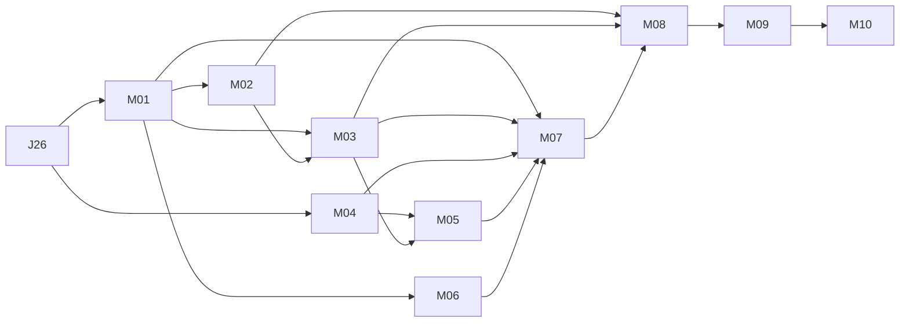

# Native macOS support for Jury

This is the implementation plan for a macOS follow-on to the first Linux
experimental release. Jury remains pre-alpha, does not yet protect secrets,
and must not be used with real credentials. Nothing in this plan is an
independent security review or certification.

The consumer is the engineer implementing the macOS CLI and its release
maintainer. The gated feature is usable direct and witnessed CLI workflows on
native macOS. The observed defects are a native compilation failure,
unsupported strict memory controls, Linux-only storage defaults and create-new
publication, and Linux-specific execution delivery. Supersede this plan when
the implementation tasks and native artifact acceptance pass; retain historical
observations in Git, not a second permanent certification ledger.

## Progress

- [x] Inspect the clean baseline at
  `48946faa10f7c0ae16f00c9a4d654d24a37fdb12` on 2026-09-05.
- [x] Inspect the release graph and existing deferred J12M issue.
- [x] Compile the workspace and run focused native boundary tests.
- [x] Check pinned provider source and current primary platform documentation.
- [x] Complete four planning review rounds and integrate findings to steady state.
- [x] Convert the final tasks to Beads without changing the Linux release join.
- [x] Audit the plan and Beads against merged J25 and licensing changes at
  `c5e40d166763b74c12d2434948b04e857bed3a21` on 2026-09-05.
- [x] Audit M01 for implementation closure and bind its Darwin protection,
  provider ownership, failure tests, and native-run contract on 2026-09-05.
- [ ] Implement the macOS work after the Linux release prerequisite.
- [ ] Pass native minimum-version and current-version acceptance.
- [ ] Prepare installable artifacts and complete the release binding.

Planning completion and implementation completion are different states.
Unchecked implementation items stay open after the planning session ends.

## Surprises & Discoveries

1. This repository is far beyond an empty scaffold in code, although its
   security and release status remains pre-alpha. Direct and witnessed command
   implementations, portable transfer, backup/restore, and juryd exist.
2. `jury-process` already executes its native macOS suite successfully: 36
   tests passed. This is useful engineering evidence for one host, not full
   macOS support or an independent review.
3. `cargo test --workspace --locked --no-run` fails with E0432 at
   `crates/jury/src/cli/execution_commands.rs:19`: `MemfdFlags`, `SealFlags`,
   `fcntl_add_seals`, and `memfd_create` are unconditionally imported.
4. Merely guarding those imports is insufficient. The command dispatcher
   refuses all non-Linux execution; its storage defaults and execution helper
   are also Linux-specific.
5. `sanitization` 2.0.3 supports native guarded allocation, but its selected
   guarded backend implements fork exclusion only on Linux and dump exclusion
   only on Linux/FreeBSD. Native guarded allocation support is not strict
   protection support. Jury's strict allocation correctly refuses this host.
6. The locked `rustix` 1.1.4 source already exposes Apple
   `renameat_with(..., RenameFlags::NOREPLACE)`, mapping to `RENAME_EXCL`.
   Jury's wrapper, rather than this dependency, currently excludes macOS.
7. The filesystem already recognizes verified `/tmp`, `/var`, and `/etc`
   system aliases. The plan should extend the existing capability boundary,
   not replace it with unconditional canonicalization.
8. Some native tests are excluded wholesale with Linux-only crate attributes.
   A successful macOS Cargo invocation can therefore omit entire workflows.
9. `docs/security/protected-primitives.md` describes an 8 MiB large allocation
   ceiling while current `memory.rs` declares 16 MiB. Resolve that stale
   descriptive statement with the provider work; do not alter format limits
   merely to match the old prose.
10. A synthetic descriptor-exec probe opened `/bin/echo` and `/bin/sh`
    read-only and passed each inherited descriptor to a Python subprocess
    using `/dev/fd/<descriptor>` as its executable. Both attempts failed with
    permission error 13 on this host. This rules out that attempted substitution
    here; it is not a proof that every possible native launch design fails.
11. Strict `ProtectedMemory` construction is a shared boundary used directly by
    crypto, storage, witness, CLI, and test code. Several callers materialize
    private bytes without first using `capture_after_process_protection`.
    Darwin core suppression therefore has to run inside the strict constructor,
    before its initializer, rather than relying on a call-site convention.

## Decision Log

- Target the full native CLI: direct and witnessed read, inject, exec, run,
  approval, receipts, transfer, and backup/recovery. Developer-only compilation
  would leave the principal user workflows unavailable.
- Treat macOS as a separate follow-on release scope. The existing `jury-qv4`
  epic still delivers Linux; J25 and J26 retain their current requirements.
  Planning does not reopen or expand that active release.
- Keep J12M and the new macOS inventory deferred. The earlier operator decision
  requires explicit future activation. J26 completion is a prerequisite, not
  automatic reactivation; this planning request authorizes the plan and tracker
  conversion, while implementation scheduling remains deferred.
- Plan for macOS 15 and newer on both Apple Silicon and Intel, with separate
  architecture artifacts. This is a proposed product floor chosen for native
  CI availability, not a support claim inferred from Rust's lower OS floor.
  Tests on macOS 26 alone cannot establish macOS 15 support.
- Keep `unsafe_code = "forbid"` in Jury. Required Mach/BSD integration must
  live behind a maintained safe provider. An external provider change is real
  prerequisite work, not an excuse to add unchecked FFI to this workspace.
- Preserve strict protection semantics. Do not make degraded protection the
  macOS default, relabel unsupported controls as established, or change the
  tests to accept missing controls.
- Define Darwin strict protection explicitly. A successful strict allocation
  requires a dedicated guarded mapping, page lock, guard pages, canaries,
  provider-established `VM_INHERIT_NONE` fork exclusion, and verified soft and
  hard `RLIMIT_CORE` values of zero before its initializer runs. Darwin has no
  supported per-mapping ordinary-core exclusion in the inspected APIs, so its
  report remains `dump_exclusion = unsupported` and separately reports
  process-wide core suppression. The Darwin strict-readiness predicate accepts
  that exact pair; it never reports the per-mapping control as established.
  This claim covers the ordinary BSD core path only, not Crash Reporter,
  debuggers, task ports, privileged access, or other forensic capture paths.
- Use `~/Library/Application Support/Jury/` for default macOS private roots,
  retaining separate `identities`, `state/vaults`, and `vaults/default`
  subtrees. These are durable state, not cache. Existing Linux XDG semantics
  remain unchanged.
- Keep the portable artifacts, cryptographic suite, canonical bytes, wire
  protocol, and receipt claims unchanged. A platform port should not introduce
  a new vault format or silently revise the witnessed action assurance.
- Reuse the existing process owner. Its limited guarantee covers members that
  remain in the created process group; deliberately detached descendants are
  outside that guarantee on both platforms.
- Do not assume `/dev/fd` is a replacement for every `/proc/self/fd` use.
  Reading a descriptor, selecting a working directory, executing a pinned
  image, and supplying a seekable sealed file are different contracts.
- Keep the existing deferred J12M record as the process-work owner. Link the
  new plan to it instead of creating a second process-containment task.
- A foreground juryd used by native integration tests is in scope. A supported
  launchd service, Keychain identity protector, Secure Enclave integration,
  GUI/TUI, Windows, and Homebrew publication are not required for this CLI
  milestone. These need their own requested scope.
- Build and prepare packages before external publication. Signing credentials
  and publication authorization are release-time inputs, never committed
  fixtures, plan contents, or guessed account configuration.

## Outcomes & Retrospective

The current tree cannot deliver a native macOS Jury CLI. It does contain a
working initial process backend and a largely reusable portable core. The
largest uncertainties are strict memory protection and preserving the existing
execution identity and anonymous-file contracts on Darwin. Resolve those before
advertising support or allocating effort to distribution polish.

Four initial planning review rounds reached steady state. An additional
acceptance-recipe review tightened two test oracles. The M01 closure audit then
selected the Darwin strict profile and assigned its provider and test work.
Beads epic `jury-2bg` holds nine new tasks and the reused deferred J12M task,
with 18 prerequisite edges matching the plan. Native
compilation/protection/publication blockers remain; no application code or
existing Linux release requirements changed.
No implementation task is complete merely because it has been written down.

## Context and orientation

Read `AGENTS.md`, `agent-map.md`, `crates/AGENTS.md`, and the nearest crate guide
before implementation. `.agent/PLANS.md` defines this document's living-plan
contract. Use `br`, never `bd`, for the tracker and robot-only `bv` commands.

The workspace has eight crates:

| Owner | Existing responsibility | macOS impact |
| --- | --- | --- |
| `crates/jury` | CLI, secret input, local and witness adapters | Dispatch, homes, process delivery, integration tests |
| `crates/jury-core` | Domain, crypto, policy, access and recovery | Reuse behavior; prove native provider and protocol behavior |
| `crates/jury-protocol` | Bounded canonical public formats | Preserve bytes and assurance semantics |
| `crates/jury-filesystem` | Capabilities, private roots, publication, locking | Create-new rename, aliases, ACLs, durability, defaults |
| `crates/jury-protected` | Guarded memory, entropy, redaction, core suppression | Strict provider blocker |
| `crates/jury-process` | Child-group supervision and capture | Validate/fix provisional backend |
| `crates/jury-witness` | juryd HTTP/TLS, SQLite and persistence adapters | Native test peer; no launchd release promise |
| `crates/jury-tui` | Deferred terminal UI boundary | Must continue compiling; no new UI work |

The workspace declares Rust 1.90 and edition 2024. Dependencies are pinned;
there is no checked-in Rust toolchain file. `scripts/jig` is development
harnessing only. Jury must remain installable and executable without Jig.

### Original measured baseline

The host reported macOS 26.6.2, build 25G83, arm64, and Rust 1.98.1 with host
target `aarch64-apple-darwin`. Only synthetic repository fixtures were used.
These results do not cover Intel, macOS 15, Rust 1.90, or a release build.

| Command | Observed result | Limit |
| --- | --- | --- |
| `cargo test --workspace --locked --no-run` | Exit 101, E0432 in execution imports | Workspace test compilation failed; no full-suite claim |
| `cargo test --locked -p jury-protected --all-targets -- --test-threads=1` | 20 passed, 8 failed, exit 101 | Failures occur at strict protection, including tests whose intended callback is never reached |
| `cargo test --locked -p jury-process --all-targets -- --test-threads=1` | 36 passed, exit 0 | Includes real child lifecycle tests and injected/parser tests; not 36 independent native guarantees |
| `cargo test --locked -p jury-protocol --all-targets` | 33 passed across five test binaries, exit 0 | Canonical/parsing/vector behavior; no CLI or native cryptographic lifecycle claim |
| `cargo test --locked -p jury-protected -p jury-process -p jury-filesystem --all-targets -- --test-threads=1` | First filesystem unit target: 5 passed, 5 failed, exit 101 | Cargo stopped there; later targets were not executed by this command |

Filesystem failures include unsupported publication and strict-memory refusal.
The already working fixed-system-alias test passed. No assertion, dependency,
source file, or security gate was changed to obtain these observations.

### Audit after J25 and licensing landed

Current source audit: `c5e40d166763b74c12d2434948b04e857bed3a21`, also
`origin/main` when fetched on 2026-09-05. The original measurements above
belong to `48946fa`; they are not updated-revision test counts. The intervening
changes are J25 implementation `98dd627`, CI portability fixes `0cc80f7`, J25
closure `67457ec`, and licensing `07b6a05`, reconciled by merge `c5e40d1`.

J25 (`jury-qv4.6.1`) is closed. J26 (`jury-qv4.6.2`) is open and ready; its
Linux release and exact candidate binding remain prerequisites. All ten macOS
tasks and their epic remain deferred. No native primitive blocker was removed
by these commits, and no task is complete merely because upstream tests grew.

Fresh native results at the audited revision, on the same arm64 host:

| Command | Observed result | Limit |
| --- | --- | --- |
| `cargo test --locked -p jury-protocol --all-targets` | 35 passed across five binaries, exit 0 | Includes new identity/backup KDF boundary cases; no private lifecycle proof |
| `cargo test --locked -p jury-filesystem --all-targets -- --test-threads=1` | First unit binary: 5 passed, 5 failed, exit 101 | Cargo stopped before integration binaries; strict memory/publication failures persist |
| `cargo test --locked -p jury-filesystem --test hardened_boundaries -- --test-threads=1` | 20 passed, 13 failed, exit 101 | Separately executed integration binary; failures are protection/publication refusals |

The repository ancestry, symbolic-reference, linked/common-worktree,
trailing-space, reftable-refusal, and repository-substitution cases passed in
that integration run. M02 must retain those working checks and add the missing
Darwin publication/ACL/durability behavior. M03 preserves the newly shared
output naming function. M08/M09 reuse J25's regression corpus, leak scan,
alternate-provider checks, fuzz targets, and native resource cases. M10 includes
the license texts/notices required by the new repository metadata. The ten
task owners and all 18 prerequisite edges remain applicable.

The audit's `scripts/jig work check` passed formatting, harness contract, and
source-size checks. Clippy still fails on Darwin's unused resolver and
needless return in `local_state.rs`; workspace tests still stop at the Linux
memfd imports in `execution_commands.rs`. No source or gate was changed.
Jig's gate summary also cannot attest the contract/source-size scope against
the original pre-merge baseline: it reports an index/baseline mismatch for
the edited tracker export. Those command passes do not establish a green
planning-session gate; the existing session remains open.

### Source locations that determine the work

- `crates/jury/src/cli/dispatch.rs::execute` rejects non-Linux commands before
  environment capture. Preserve early rejection for capabilities that are not
  implemented; replace the blanket gate only as real workflows land.
- `crates/jury/src/home.rs` selects identity and global vault roots only on
  Linux unless explicit applicable overrides exist.
- `crates/jury-filesystem/src/local_state.rs::resolve_linux_state_root` refuses
  non-Linux even with an explicit `JURY_STATE_HOME` argument.
- `crates/jury-filesystem/src/private_output.rs::rename_noreplace` originally
  refused non-Linux. M02 now uses Darwin `RENAME_EXCL` for new private/public
  files and recovery markers; other unsupported platforms still refuse.
- `crates/jury-filesystem/src/capability.rs` owns retained file identities and
  known system-alias handling; `path_separation.rs` owns overlap checks.
- `crates/jury-filesystem/src/repository.rs` now retains the Git common
  directory, bounds symbolic-reference traversal, and revalidates worktree
  identity; its J25 regression tests already execute on Darwin.
- `crates/jury/src/cli/output_path.rs::normalize` now shares witnessed
  read/inject output naming. It canonicalizes the parent and preserves the
  leaf; it does not authorize publication.
- `crates/jury-protected/src/memory.rs::request` requests required lock, dump,
  fork, guard, and canary controls in strict mode.
- `crates/jury-protected/src/process_protection.rs` uses `rlimit` to set hard
  and soft `RLIMIT_CORE` to zero before the private callback.
- `crates/jury-process/src/unix.rs` calls `libproc` 0.14.11 for process-group
  snapshots and rejects malformed or incomplete observations.
- `crates/jury-process/src/process.rs` retains the unreaped leader, signals,
  confirms consecutive quiescence, and only then consumes wait status.
- `crates/jury/src/cli/execution_commands.rs` owns Linux memfd delivery,
  `/proc/self/exe` helper re-entry, pinned executable/cwd descriptor paths,
  descriptor scrubbing, and direct/witnessed execution.
- `crates/jury/src/cli/execution_commands/witnessed.rs` binds those execution
  choices to foreground approval and receipts.
- `crates/jury/tests/native_cli.rs` and juryd's integration test entrypoints
  use Linux-only compilation gates.
- `.github/workflows/rust-tests.yml` and `security-invariants.yml` run Ubuntu
  jobs; there is no checked-in macOS release workflow.
- J25 adds four jobs to `security-invariants.yml` and the corresponding
  `scripts/check-j25-*` runners. Its measurement runner explicitly requires
  Linux and uses `/proc` and GNU `time`; a macOS runner label is insufficient.
- `Cargo.toml`, `LICENSE.md`, and `NOTICE.md` now declare `Elastic-2.0` and
  require Jury and applicable third-party license texts/notices in distributions.

### Primary sources and what they establish

Sources were inspected on 2026-09-05. Recheck mutable documentation at the start
of implementation and before freezing a release toolchain.

1. [Apple filesystem guide](https://developer.apple.com/library/archive/documentation/FileManagement/Conceptual/FileSystemProgrammingGuide/MacOSXDirectories/MacOSXDirectories.html)
   identifies Application Support as persistent application data and Caches as
   recreatable data. The exact Jury subdirectory layout is our design choice.
2. [Rust macOS target support](https://doc.rust-lang.org/rustc/platform-support/apple-darwin.html)
   documents Apple targets and `MACOSX_DEPLOYMENT_TARGET`. Rust's supported
   target list does not prove Jury's providers or workflows on those targets.
3. [GitHub hosted runners](https://docs.github.com/en/actions/reference/runners/github-hosted-runners)
   currently lists `macos-15`/`macos-26` arm64 and
   `macos-15-intel`/`macos-26-intel`. Runner availability must be rechecked;
   `macos-latest` is not an architecture or minimum-OS contract.
4. [rustix 1.1.4 source](https://docs.rs/crate/rustix/1.1.4/source/src/fs/at.rs)
   and its `src/backend/libc/fs/types.rs` and `syscalls.rs` establish Apple's
   safe flagged-rename path. Local locked package source was also inspected;
   Linux-rendered API docs alone omit meaningful target distinctions.
5. [sanitization 2.0.3 guarded provider source](https://docs.rs/crate/sanitization/2.0.3/source/src/mapped/guard_pages.rs)
   establishes that the pinned backend reports Darwin dump and fork exclusion
   unsupported. The audited package has checksum
   `75e43f2762b31232062e8ba7bfbdfcbd33c80c43bf7a306a7e195c3c4f734e0f`
   and records upstream revision `ffcb211cd931c6966b2e767ce5edffa4b47c4f07`.
6. [Apple minherit manual](https://developer.apple.com/library/archive/documentation/System/Conceptual/ManPages_iPhoneOS/man2/minherit.2.html)
   documents `VM_INHERIT_NONE`; [XNU's ordinary fork-map implementation](https://github.com/apple-oss-distributions/xnu/blob/main/osfmk/vm/vm_map.c)
   skips entries with that inheritance value when building the child map. M01
   must establish it through the safe provider before initialization and verify
   the behavior natively on both architectures.
7. [Apple madvise manual](https://developer.apple.com/library/archive/documentation/System/Conceptual/ManPages_iPhoneOS/man2/madvise.2.html)
   lists Darwin's supported advice values and supplies no per-mapping
   `MADV_DONTDUMP`/`MADV_NOCORE` equivalent. M01 must not invent one or reuse a
   Linux numeric constant.
8. [Apple getrlimit manual](https://developer.apple.com/library/archive/documentation/System/Conceptual/ManPages_iPhoneOS/man2/getrlimit.2.html)
   defines `RLIMIT_CORE` as the largest core file the process may create.
   [XNU's ordinary core implementation](https://github.com/apple-oss-distributions/xnu/blob/main/bsd/kern/kern_core.c)
   checks that limit unless invoked with an internal ignore-limit flag. M01's
   process-wide claim is limited to this ordinary path and requires a successful
   set followed by an exact `(0, 0)` readback.
9. [Apple XNU system-call definitions](https://github.com/apple-oss-distributions/xnu/blob/main/bsd/kern/syscalls.master)
   are an input to the execution investigation. Do not infer descriptor-exec
   support from POSIX API names that exist only on other platforms.
10. [Apple notarization](https://developer.apple.com/documentation/security/notarizing-macos-software-before-distribution)
   and [custom notarization workflows](https://developer.apple.com/documentation/security/customizing-the-notarization-workflow)
   describe Developer ID signing, Hardened Runtime, and `notarytool`.
   Notarization is not independent product security review.

## User-visible target

### Installation and first use

An operator can install the artifact for their native architecture, run
`jury --help`, and see the pre-alpha warning and truthful supported features.
They can initialize `ExamplePrincipal` and `ExampleVault` in strict mode using
synthetic values, with private state outside the Git worktree.

The normal macOS path must not require root, a Linux VM, Rosetta, Jig, or a
global degraded-protection flag. Build dependencies may include Xcode Command
Line Tools; runtime dependencies must be documented from the built binary.

### Storage contract

Preserve vault selection order:

1. `--home` when supplied; reject simultaneous `--global`.
2. `--global` selects the platform global vault.
3. Nonempty `JURY_HOME`.
4. Discovered repository `.jury`.
5. Platform global default outside a repository.

On macOS use the following proposed defaults:

| Purpose | Default | Explicit override |
| --- | --- | --- |
| Global encrypted vault | `~/Library/Application Support/Jury/vaults/default` | `--home` or `JURY_HOME` according to precedence |
| Private identities | `~/Library/Application Support/Jury/identities` | `JURY_IDENTITY_HOME` |
| Authenticated local state | `~/Library/Application Support/Jury/state/vaults` | `JURY_STATE_HOME` |
| Repository vault | `<worktree>/.jury` | Existing discovery/explicit selection |

XDG variables retain their existing Linux meaning and are not silently adopted
as macOS defaults. A user who intentionally wants an existing custom layout
uses explicit Jury overrides. Overrides remain absolute, validated paths;
an invalid explicit value never falls through to a new identity or vault.

No implicit migration searches old directories, merges identities, overwrites
local pins, or uploads private state. Shared ciphertext remains portable;
authenticated local state remains identity- and lineage-scoped.

### Direct and witnessed workflows

Direct users must be able to create an identity and vault, manage items and
fields, explicitly authorize unilateral access, read or inject to a private
destination, run children, export/import, and complete backup/restore drills.

Witnessed users must be able to configure policy, inspect the complete exact
request, approve or deny interactively, execute a foreground governed read,
inject, exec, or run against configured witnesses, cancel, and verify receipts.
Detached request artifacts retain their current non-executable semantics.
There is no persisted session receiver or witness-contribution cache.

Successful Linux-to-macOS and macOS-to-Linux transfers must preserve exact
canonical artifacts and authority. They must not relax rollback, divergence,
direct-slot introduction, or quorum checks.

### Process contract

Support both transparent exec and bounded brokered run with the current
environment policies, stdin behavior, output redaction, status, signals,
deadlines, and cleanup guarantees. No selected value goes into argv or a
named plaintext temporary file. A child's permitted environment is necessarily
visible to that child; redaction does not prevent deliberate exfiltration.

The current file-delivery contract includes anonymous, read-only, bounded,
seekable contents and refusal of mutation. A FIFO, a writable shared-memory
object, and a named temporary file are not interchangeable replacements.
If Darwin cannot preserve a requirement, that is an unresolved product gap,
not a reason to close the full-support milestone with an unsupported branch.

## Plan of work and dependencies

The following task keys are stable within this plan. The Beads mapping below
will contain their actual tracker IDs. All new work belongs to a separate
macOS follow-on epic. Existing J12M remains the process-containment task.

All macOS tasks are planned behind the existing Linux J26 completion. This
keeps the earlier explicit first-release cut intact. The planning request does
not authorize publishing macOS as part of that first Linux release.
The inventory remains deferred pending a later implementation activation.
After activation, `br ready --epic jury-2bg --type task --json` selects
only tasks whose prerequisites are complete. During planning, an empty ready
list for this deferred epic is expected.

| Key | Deliverable | Direct prerequisites | Unblocks |
| --- | --- | --- | --- |
| M01 | Strict Darwin protected-memory provider and integration | J26 | M02, M03, M06, M07 |
| M02 | Safe native publication, ACL and filesystem behavior | M01 | M03, M08 |
| M03 | Buildable native CLI, homes, and working non-child commands | M01, M02 | M05, M07, M08 |
| M04 / J12M | Validated native process containment | J26 | M05, M07 |
| M05 | Native launch with retained executable/cwd identity | M03, M04 | M07 |
| M06 | Anonymous immutable field-file delivery | M01 | M07 |
| M07 | Direct and witnessed child execution integration | M01, M03, M04, M05, M06 | M08 |
| M08 | Native lifecycle, recovery, and cross-OS interoperability | M02, M03, M07 | M09 |
| M09 | Required native CI and macOS developer commands | M08 | M10 |
| M10 | Installable macOS candidates, support docs, release binding | M09 | macOS epic completion |



The long-risk path is strict memory plus native launch/file delivery into
witnessed execution and full lifecycle verification. Filesystem/default-path
work can proceed independently of launch once the Linux release is complete.
No timing estimate is asserted until the provider investigations have a
working result. In particular the old J12M two-hour estimate does not estimate
this whole platform port.

### M01 — Establish strict Darwin protected memory

**Purpose and rationale.** Ordinary identity capture fails today because the
selected guarded provider cannot satisfy Jury's mandatory controls on Darwin.
Making allocations compile or making the degraded path work does not enable
the strict user workflow. The deliverable is the provider capability and the
`jury-protected` integration; full native CLI compilation remains M03 work.

**Inputs and ownership.** Read `crates/jury-protected/AGENTS.md` and own changes
to `src/memory.rs`, `src/process_protection.rs`, `src/randomness.rs`, any needed
`src/lib.rs` export, `crates/jury-protected/Cargo.toml`, the workspace
`Cargo.lock`, focused tests, and `docs/security/protected-primitives.md`. Audit
`crates/jury/src/secret_input.rs`, `crates/jury-core/src/crypto.rs`,
`crates/jury-core/src/j25_measurements.rs`, and `crates/jury-tui/src/lib.rs` as
status consumers. Replace `secret_input.rs`'s hard-coded per-mapping status
check with `ProtectionStatus::is_degraded`; do not otherwise absorb M03's native
CLI work. Inventory every strict constructor and `protected_random` call site
before editing so all paths still converge on `initialize_bounded`.

The maintained safe-provider work now belongs in
`third_party/sanitization`, imported from the operator-owned fork at
`3f0a72c5640b4919dec93799725c7573b2878a8c`. Provider implementation and tests
are developed here together with Jury integration. The upstream v2.0.4 base
and import revision remain recorded in the provider workspace metadata;
Jury commits and release source hashes bind subsequent local changes.
Read its `AGENTS.md` before native backend work. Keep the provider's separate
workspace, original licenses, safe API, and native tests. Historical external
revision evidence below remains historical; it does not verify later edits.
This ownership cutover is authorized by the operator on 2026-09-07.

**Chosen Darwin strict contract.** For a nonempty strict allocation, require:

| Fact | Required Darwin report or observation |
| --- | --- |
| Dedicated mapping | `Established` |
| Page lock | `Established`, with the provider's rounded writable region accounted for |
| Guard pages and canary | Both `Established` |
| Fork exclusion | `ForkPolicy::Exclude` and `Established`, implemented with `VM_INHERIT_NONE` |
| Per-mapping ordinary-core exclusion | `Unsupported`; never rewrite it to `Established` |
| Process ordinary-core suppression | successful `setrlimit` plus `getrlimit` readback of soft `0`, hard `0` |

`ProtectionStatus::is_degraded` and the memory-control predicate may treat
`dump_exclusion = Unsupported` plus verified process suppression as satisfying
the Darwin ordinary-core part of strict mode. They must still reject
`Failed`, `NotRequested`, or `CompatibilityOnly`, and all other mandatory facts
must be established. Linux continues to require its established per-mapping
dump exclusion. Status and documentation must keep the two mechanisms visible
as separate facts and state the bounded ordinary-core claim above.

**Implementation.** Complete these steps in order:

1. In the provider's guarded and locked native mapping backends, implement
   Darwin `ForkPolicy::Exclude` with the SDK-declared `minherit` ABI and
   `VM_INHERIT_NONE`. Apply it to the complete writable data region after the
   mapping exists and before any caller fill closure runs. Update the Darwin
   support predicate and preserve value-free error/rollback reports,
   zeroization-before-unmap, guard pages, canaries, locking, bounds, and the
   existing Linux behavior. Keep all FFI and raw-pointer work in that provider.
2. Refactor Jury's existing private core suppressor so success means both limits
   were set to zero and immediately read back as `(0, 0)`. On Darwin,
   `ProtectedMemory::initialize_bounded` must establish this process control
   before invoking the provider constructor whenever policy is `Strict`.
   Every public compact/large constructor and `protected_random` already funnels
   through that function; preserve that single enforcement point. A failed set
   or readback returns the value-free protection error before the provider or
   caller initializer runs.
3. Build a Darwin-specific provider request: mapping, lock, fork exclusion,
   guards, and canary remain required; request per-mapping dump exclusion as
   `Preferred` so the provider truthfully returns `Unsupported`. Replace the
   unconditional `ProtectionReport::satisfies` decision with the exact platform
   predicate above. On every Unix construction, populate
   `core_dump_suppressed` from an exact `(0, 0)` readback instead of hard-coding
   `false`; an unavailable or nonzero observation records `false`. Strict
   Darwin already established the zero limits before provider entry. Emergency
   mode remains explicit and degraded whenever the complete predicate is not
   met.
4. Reuse the same process helper in `capture_after_process_protection` and the
   same `ProtectionStatus::is_degraded` result in `secret_input.rs`, removing its
   duplicate list of controls. Preserve the current pre-input call so terminal,
   pipe, and provided passphrases cannot be read before core suppression. Keep
   errors, serialized status, debug output, and fixtures free of addresses,
   errno details tied to secrets, and secret bytes.

The direct-crypto and witness gate manifests do not bind these provider or
`jury-protected` inputs. Do not regenerate their historical hashes merely
because M01 changes `Cargo.lock`; run or revise those gates only if an actual
listed gate input changes. M10 will extend the release binding produced by J26
to the exact macOS provider and candidate after M09.

**Tests in the same change.** The provider repository owns test-only injection
for mapping, guard setup, Darwin inheritance, lock, and canary failures. These
seams stay private to provider tests. Each required failure must happen before
the fill marker, return no owner, and complete the applicable cleanup. Its
native fork test owns the raw mapping observation: keep the parent owner alive,
fork, query or fault the exact original data range in the child, return only a
boolean or bounded exit status, and reap the child on every path. The oracle
must demonstrate an absent child mapping rather than a copied mapping cleared
later.

Jury owns a private test-only core-suppressor seam and status-predicate tests;
do not expose a production fault-injection feature. Test set failure and
readback failure before provider/initializer invocation, exact Darwin status,
strict and emergency decisions, partial initializer and entropy failure,
compact/large bounds, cleanup, and value-free errors. Run core-limit cases in
subprocesses because the hard limit is intentionally irreversible. Inspect both
limits inside the initializer to prove ordering. Do not create or inspect a
secret-bearing core file.

Measure the actual page and lock granules rather than assuming 4096-byte pages.
The denominator is compact-boundary and large-boundary strict allocations on
each named native lane; report accepted, refused, and cleanup outcomes plus
requested/mapped/locked bytes. This is behavior evidence, not a performance SLO.

**Native and regression lanes.** Before closing M01, run the exact provider
selected-feature suite
`cargo test --all-targets --no-default-features --features std,profile-guarded-native,require-fork-exclusion`
and
`cargo test --locked -p jury-protected --all-targets` on native macOS 15
Apple Silicon, native macOS 15 Intel, and the then-current macOS release on at
least Apple Silicon. Use Rust 1.90 for at least the minimum-version lanes and
record the exact OS build, architecture, Rust version, provider revision, and
test/ignored counts. Run the same provider selected-feature suite,
`cargo test --locked -p jury-protected --all-targets`, and
`cargo test --locked -p jury --lib secret_input` on Linux. M09 owns permanent
macOS CI; if M01 uses a temporary workflow to obtain these runs, delete it
before closure after its bounded output is attached to the task evidence.

**Acceptance.** All named lanes pass without filtering away the fork, core,
strict, or cleanup tests. A strict Darwin initializer observes `(0, 0)` core
limits and runs exactly once; its status reports mapping/lock/fork/guards/canary
established, per-mapping dump unsupported, process suppression true, and
`is_degraded() == false`. An injected failure of every mandatory owning-layer
step prevents the private marker. The provider child oracle proves the mapping
absent after fork on both architectures. Linux still reports and requires
per-mapping dump/fork establishment. The implementation and
`docs/security/protected-primitives.md` agree on the existing 1 MiB compact and
16 MiB large ceilings without changing protocol limits. The dependency is
immutably pinned and its applicable license/notice data is updated. Missing,
skipped, or report-only native controls keep M01 open.

**Dependencies and recovery.** Blocked by J26 and explicit activation; unblocks
M02/M03/M06/M07. Provider authorization or an already qualifying immutable
release is an activation input, not a new claim about current availability.
Experiments use synthetic allocations only. Revert an unsuccessful provider
pin and its Jury integration together. Process core suppression may remain in
the failed test subprocess until it exits. Do not rewrite historical gate or
release hashes.

### M02 — Implement native filesystem publication and validation

**Activation and audit (2026-09-07).** See [the implementation semantics and native test recipe](macos-filesystem.md).

 The operator explicitly requested M02
implementation. This supersedes the earlier scheduling deferral for M02 only;
M01 is closed and its implementation is present in the staged baseline. The
Linux release and other macOS task scopes are unchanged. Native baseline at
`16ab899` plus the staged M01 changes: five filesystem unit tests pass and five
fail with `Publish/Unsupported`; strict memory now initializes successfully.

The implementation uses pinned `calcifer-macos-acl` 0.1.0 (MIT) for
`BorrowedFd`-bound extended ACL inspection. Its packaged source has bounded
native decoding, RAII ownership, and preserves unknown policy bits. It is a
small provider in the actively maintained Calcifer project, not independently
reviewed security infrastructure. The selected policy rejects every nonempty
extended ACL (including deny-only and otherwise harmless entries) without
modifying existing trees or resolving account identities. Recheck retained
roots and every freshly opened file before private reads or writes. Test the
fresh-file check directly with native inherited ACLs and a callback marker.

On Darwin, publication requires APFS as observed through `fstatfs` on the
retained descriptor. Use rustix 1.1.4's Apple `NOREPLACE = RENAME_EXCL`
mapping and `fcntl_fullfsync` for files and parents. Unsupported volume or
pre-commit sync operations refuse explicitly; post-rename sync errors remain
`PublishedButParentUnsynced`. These are successful OS persistence requests,
not experimentally established survival of power loss. Existing Linux sync
semantics remain in place. Case-sensitive and case-insensitive native APFS
acceptance are both required; unavailable coverage remains pending.

Source refresh: [provider source](https://docs.rs/calcifer-macos-acl/0.1.0/calcifer_macos_acl/),
[Apple descriptor ACL manual](https://developer.apple.com/library/archive/documentation/System/Conceptual/ManPages_iPhoneOS/man3/acl_get_fd.3.html),
and [Apple sync semantics](https://developer.apple.com/library/archive/documentation/System/Conceptual/ManPages_iPhoneOS/man2/fsync.2.html).
The local locked rustix Apple types and syscall source were inspected as well.


**Implementation outcome (2026-09-07).** Commit `9323a55` implements M02.
The native image runner passed 61 tests on each APFS case mode and the explicit
HFS+ refusal test; its subprocess probe remains deliberately ignored in direct
listing and is exercised by the kill/restart parent. The exact commit candidate
passed Linux filesystem tests and Clippy. Direct and witness gate verifiers
accepted the unchanged inputs. Three pre-commit Codex passes found three defects
in total, all corrected with regressions; the third found no actionable defects.
Claude could not complete because its weekly provider quota was exhausted.
Final immutable commit review found no actionable findings; workspace-wide
regression disposition is recorded separately from native filesystem acceptance.
The full Linux workspace test command passed on exact commit `9323a55` in an
init-enabled container. M02 is closed in Beads.

**Purpose and rationale.** Before M02, new identities, ciphertext, receipts, and
restore markers could not be published on macOS because `rename_noreplace` refused Darwin.
Creating files with ordinary rename would introduce an overwrite race.

**Ownership.** `crates/jury-filesystem/src/private_output.rs`, `capability.rs`,
`state_root.rs`, `path_separation.rs`, `private_input.rs`, `lock.rs`, and their
unit/integration tests. Preserve the capability-held directory and leaf APIs.

**Implementation.** Enable the already pinned safe rustix Apple flagged-rename
operation with `RenameFlags::NOREPLACE`; confirm its actual target mapping.
Retain typed existing-destination and unsupported-filesystem errors. Keep
encrypted worktree publication distinct from owner-only publication.

Inspect macOS ACL effects on private roots and files. Mode 0700/0600 alone is
not an ACL oracle. Through a maintained safe descriptor-based provider,
reject or safely establish the required effective private-access boundary
before private bytes are written. Do not shell out with private paths or
recursively chmod a user-selected existing tree.
Validate each newly created temporary file through its held descriptor,
including inherited ACL entries, before `ProtectedMemory::expose` or any write.
An existing-root check alone is insufficient. Include a synthetic inherited
allow-entry case whose rejection never invokes the private callback.

Verify retained identity comparisons on case-insensitive and case-sensitive
APFS, Unicode/case aliases, hard links, symlink swaps, parent renames, and
cross-worktree roots. Continue allowing only the already verified fixed
system aliases; do not permit arbitrary symlink traversal as a portability fix.

Preserve J25's working `repository.rs` behavior and the native cases in
`tests/hardened_boundaries.rs`: retained common-directory identity for linked
worktrees, current common refs/packed refs, bounded symbolic-reference chains,
trailing spaces in Git paths, no-follow intermediate control directories,
whole-worktree/path substitution rejection, and explicit reftable refusal.
Extend this owner for Darwin-specific gaps; do not reimplement Git discovery
or widen accepted reference storage merely to finish the port.

Establish the exact file and parent-sync semantics on local APFS. Check whether
the stated durability contract needs a safe full-sync operation on Darwin.
Document which persistence claim those operations establish. Injected sync
failures prove commit/error classification; successful calls and process
restart tests must not be described as power-loss durability proof.
Never turn a post-rename parent-sync failure into an uncommitted failure:
preserve `PublishedButParentUnsynced` and retry reconciliation. Network or
other filesystems without the required operation get an explicit refusal.

**Tests in the same change.** Run competing create-new publishers against the
same destination; exactly one wins, and the other cannot replace its bytes.
Test alias/permission/ACL refusal before private callbacks, temporary identity
swaps, sync failures, quarantine cleanup retries, and retained parent behavior.
Use synthetic files and owned temporary directories/APFS test volumes only.
Port J25's Linux-gated `abrupt_publication_is_always_complete_and_retryable`
and its subprocess probe in `private_output/tests.rs` to execute the same
before-publication, after-rename-before-parent-sync, and after-publication
kill/restart cases on Darwin. They are absent from the ten-test native unit
count; preserve the helper's deliberate ignored status and invoke it through
the owning parent test. A process kill does not simulate loss of power.

**Acceptance.** Existing filesystem tests plus macOS-specific ACL, alias,
create-new, and durability cases pass. The audited five failing unit cases and
13 failing hardened-boundary cases are accounted for; cases dependent on
strict memory run after M01 rather than
being weakened. No private output goes through unchecked path authority.

**Dependencies and recovery.** Blocked by M01; unblocks M03/M08. Its native
acceptance includes strict-memory publication fixtures, so the task cannot
close before M01. Partial publication preserves the existing
typed commit outcome and identity-bound cleanup contract.

### M03 — Make native non-child CLI workflows usable

**Purpose and rationale.** Default identity and state roots currently fail on
Darwin, and the whole CLI does not compile. A port must deliver actual identity,
vault, read/inject, transfer, and recovery behavior with the platform defaults.

**Ownership.** `jury/src/home.rs`, `cli/dispatch.rs`, `cli/environment.rs`,
`cli/context.rs`, `cli/output_path.rs`, `cli.rs`,
`jury-filesystem/src/local_state.rs`, their public
exports/callers, and `jury/src/cli/execution_commands.rs` platform imports.

**Implementation.** Add one platform-selected root resolver with pure injected
environment inputs. Retain the existing Linux resolver's behavior for callers
that explicitly depend on it; route ordinary CLI state selection through the
new platform resolver. Implement the macOS table and precedence above.
Avoid process-global environment mutation in parallel tests.

Separate Linux execution internals behind target modules so non-child native
commands can compile. Add macOS capability preflight before passphrase capture,
decryption, witness contact, or output preparation for unimplemented child
delivery. The intermediate refusal is visible unfinished M07 work, not the
completion criterion for this platform plan.

Remove the blanket Linux dispatcher refusal only for implemented macOS paths.
Keep unsupported targets explicit. Update help/status descriptions alongside
working behavior while retaining the pre-alpha warning. Exercise ordinary
strict operation without requiring explicit homes for every command.

No macOS default may overlap a repository, identity root, global vault, restore
destination, or authenticated state in ways forbidden by current separation
rules. Reject malformed overrides instead of silently selecting another home.
Handle spaces and non-UTF-8 OS path inputs without lossy identity changes.

Reuse `cli/output_path.rs::normalize` for witnessed read/inject naming. Its
parent canonicalization and unchanged leaf are the current approved-name
contract; they do not replace retained filesystem authority. Preserve its
absolute-path, missing-parent, parent-component, and non-UTF-8-output refusal
behavior. Do not change it into whole-path canonicalization, normalize an
action after approval, or promise non-UTF-8 witnessed outputs merely because
other OS path inputs can be represented losslessly.

**Tests in the same change.** Assert exact native default paths, all precedence
branches, empty/missing/relative/NUL/parent-component inputs, repository and
linked-worktree discovery, and explicit legacy paths. Prove init/read/inject,
export/import, and absent-target recovery through native CLI subprocesses.
Check that failed preflight makes no private state, request, or output file.

**Acceptance.** Native `cargo test --workspace --locked --no-run` succeeds;
Rust warnings introduced by target separation are fixed without lint blanket
allowances. The planned non-child strict workflows run with actual defaults.
Linux defaults and canonical artifacts remain unchanged.
The shared witnessed-output naming tests pass without widening path authority
or altering the approved destination bytes.

**Dependencies and recovery.** Blocked by M01/M02; unblocks M05/M07/M08. No automatic
state migration. Existing custom users can explicitly point at their old roots.
On invalid existing state stop with a typed error; never initialize a parallel
identity as a recovery shortcut.

### M04 / J12M — Validate and finish native process containment

**Purpose and rationale.** The initial native suite already passes on one
arm64 host. Confirm the real guarantees across supported hosts and fix only
observed deficiencies; do not replace the backend merely to generate work.

**Ownership.** Reuse Bead `jury-qv4.3.4`, `crates/jury-process/AGENTS.md`,
`src/unix.rs`, `src/process.rs`, and the existing split process tests.

**Implementation and validation.** Retain the unreaped leader while numeric
group signaling remains possible. Verify native `waitid(...WNOWAIT)` behavior,
leader-only/zombie snapshots, disappeared members, EPERM, duplicate/zero PID
observations, signal failure, and bounded enumeration under churn.
Inspect libproc's allocation and snapshot completeness behavior; a pair of
truncated snapshots is not a proof of quiescence. Bound or refuse ambiguous
enumeration through its safe provider rather than treating omission as exit.

Retain separate primary-operation and cleanup failures. Do not signal after
ECHILD, consumed status, or loss of group ownership. Wait, scan, and drain
deadlines remain absolute and include time spent in native provider calls.
Actual uninterruptible provider-call limits must be documented honestly.

**Tests in the same change.** Run the current 36 cases on both architectures,
plus targeted gaps found by native inspection. Cover successful leader exit
with descendants, timeout, cancellation before/after spawn, signal status,
partial setup, stdin refusal, output overflow, streaming redaction, observer
failure, escaped pipe owners, and cleanup failure. Use handshakes for races
rather than enlarging sleeps until a flaky assertion passes.

**Acceptance.** Native supported-version tests pass and the platform status
becomes supported only at the final integration/release boundary. If no code
defect is found, record that truthful null result and native evidence in this
task. Existing synthetic snapshot tests are not described as native libproc
evidence. Detached descendants remain an explicit limitation.

**Dependencies and recovery.** Blocked by J26; unblocks M05/M07. Reuse the
existing task without closing it solely on the initial 36-test baseline.
Test children are owned, bounded, and cleaned on every test error path.

### M05 — Implement native launch without pathname substitution

**Purpose and rationale.** Linux re-enters `/proc/self/exe` and launches using
held executable/cwd descriptors. A plain `current_exe()` or revalidated path
introduces a race that changes what an approval authorizes.

**Ownership.** `jury/src/cli/execution_commands.rs::{internal_exec,
helper_command}`, `execution_commands/support.rs`, command validation and
manifest construction, and a narrow safe platform launch provider as needed.
Keep domain/witness policy outside `jury-process`.

**Implementation.** Build a native synthetic launch prototype before adapting
private delivery. Establish separate answers for already-running Jury image
identity, held executable identity, cwd identity, descriptor scrubbing,
process-group creation, and exit status. Check current Darwin SDK and provider
contracts for spawn file actions, descriptor-directory changes, and supported
image selection. Do not assume Linux `fexecve` semantics exist on macOS.

The existing assurance commits executable path, device, inode, mode, and
length while retaining its descriptor. It is not content-stable executable
authentication: in-place mutation, interpreter identity, and dynamic
dependencies remain explicit limitations in `docs/architecture.md`. Preserve
that exact boundary rather than inventing a stronger claim or weakening
retained identity into a pathname-only check.

Capability rejection occurs before private capture or witness contact. A
later launch-time race must execute the retained approved object or fail
without delivering selected bytes to substituted code. The current helper
receives selected environment values before spawn, so validating its identity
after starting it is too late. Include a substituted helper that emits a
public marker if it receives a synthetic sentinel; the marker must stay absent.

Use a maintained safe provider for missing native operations. Prototype with
harmless Mach-O and script fixtures whose behavior can identify substitution.
Try replacement/unlink of the executable and helper path between validation
and launch, and rename the selected cwd while its descriptor is retained.
Prove that the original object executes or that launch refuses before receiving
private material. Metadata rechecking followed by path exec is not enough.

If the platform cannot meet the existing assurance, leave M05/M07 open and
write the exact unresolved requirement into this plan. Any weaker platform
assurance must be an explicit separately reviewed protocol/scope revision;
the implementer cannot silently choose it to finish the task.

Scrub all inherited descriptors except the selected channels. Avoid application
FFI or unsafe `pre_exec` callbacks, and avoid introducing a persistent helper
daemon solely for a different spawn API. Keep helper invocations version-bound
to the parent executable and fail closed on malformed hidden arguments.

**Tests in the same change.** Validate both Mach-O and shebang execution,
dynamic-loader/interpreter limitations, paths with spaces, argument bytes,
cwd replacement, leaked descriptors, invalid descriptors, helper substitution,
launch failure, forwarded status, and test-helper cleanup.

**Acceptance.** The native prototype becomes the production launch path with
the retained-object guarantees substantiated. It launches synthetic children
through the process owner on both architectures. No `/proc` dependency remains
in the macOS path, and no pathname-only workaround is described as pinned exec.

**Dependencies and recovery.** Blocked by M03/M04; unblocks M07. Experiments cannot
capture private values. Failed launch keeps the existing typed process error
and leaves no unowned child or descriptor.

### M06 — Implement anonymous immutable field-file delivery

**Purpose and rationale.** Current `--file` delivery uses sealed Linux memfd
objects. Full native exec/run support must preserve the user-visible file
contract, rather than silently persisting plaintext or substituting a stream.

**Ownership.** `jury/src/cli/execution_commands.rs::{prepare_anonymous_files,
apply_environment}`, `access_execution_args.rs`, redaction setup, and a narrow
safe provider for native anonymous storage if necessary.

**Implementation.** Prototype with `ExampleSecret` bytes and prove no named
plaintext file is created, the recipient only receives intended descriptors,
read/seek work, content length is bounded, and mutation/growth/truncation cannot
change the approved contents. Establish semantics through actual Darwin APIs.
POSIX shared memory may be investigated but is not assumed to provide seals,
read-only reopen, or the required unlinked-file identity guarantees.

Keep child file paths public routing metadata and secret values out of argv.
Ensure descriptor lifetime survives the helper and target transition without
leaking into unrelated children. Prepare every delivery channel before spawn;
partial preparation closes all owners and clears accessible protected bytes.

During construction the parent alone owns writable authority. Finalization
must remove every writable capability before spawn, including any retained
duplicate, and leave only the explicitly inherited read authority. The helper
retains only selected descriptors; completion/cancellation closes all parent
owners. Test writes, positional writes, truncation, growth, shared writable
mapping, permission changes and reopening where available. None may modify
the finalized bytes or recreate writable authority after helper transition.

If the available native primitive supports only a different file contract,
document that fact and leave this task open. A supported stdin alternative is
useful but does not fulfill file delivery. Changing the CLI or witnessed
delivery type requires an explicit scope/protocol decision, not a test skip.

**Tests in the same change.** Exercise binary/NUL bytes, zero/maximum/oversized
lengths allowed by the actual command contract, multiple descriptors, seek and
reread, child mutation attempts, partial preparation failure, inherited-FD
scrubbing, no residual named storage, cancellation, and redacted output.

The public `--file VAR=ITEM.FIELD` interface supplies a pathname in `VAR`,
not a descriptor integer. An ordinary child must obtain that path from its
environment, open it, read/seek/reread, and attempt mutation through the same
path. A successful direct-descriptor read alone does not pass acceptance.
Preserve the existing `MAX_EXEC_FILES`, `MAX_ENV_TOTAL_BYTES`, and field-value
validation owners in `execution_commands.rs`; do not invent Darwin-specific
wire or field limits.

**Acceptance.** The native implementation satisfies the existing anonymous
immutable-file contract with standalone synthetic adversarial tests. M07 owns
integration with M05; that integration is not a hidden M06 prerequisite.
Unsupported-only behavior cannot close M06 or the macOS epic.

**Dependencies and recovery.** Blocked by M01; unblocks M07. No real-secret
experiments, no named-file fallback, and no expansion of the emergency memory
flag into an implicit permission to use a weaker delivery mechanism.

### M07 — Integrate direct and witnessed child execution

**Purpose and rationale.** Neutral process supervision does not resolve vault
authorization or approval binding. Both access modes must use the same tested
native delivery mechanics without weakening the witnessed manifest.

**Ownership.** `jury/src/cli/execution_commands.rs`, its `support.rs`,
`witnessed.rs`, and tests; `jury/tests/native_cli/execution.rs` and witnessed
workflow tests. Preserve core/protocol ownership of manifests and authority.

**Implementation.** Connect native launch and file delivery to prepared
execution after capability preflight, protection, authorization, and channel
preparation. Use the existing direct/witnessed access providers. Bind exact
executable identity, cwd, public argument bytes, typed secret destinations,
field references, and environment names at the existing assurance level.

Keep transparent direct inheritance and brokered allowlists unchanged. In
witnessed mode clear ambient environment and require the exact authenticated
action. Investigate Darwin loader environment behavior without claiming that
SIP or signing provides a universal child sandbox.

Retain protected-stdin exclusivity rules, output redaction before observers,
separate stdout/stderr state, timeout/cancellation handling, local audit result,
receipt limits, and all-or-nothing pre-spawn preparation. Unsupported capability
preflight must precede secret capture and witness contribution acquisition.

**Tests in the same change.** Run direct and witnessed exec/run with each
supported delivery shape. Reject mutated arguments, cwd/executable identity,
environment targets, wrong fields, wrong revisions, expired/replayed approval,
missing quorum, and cancellation. Assert no child marker, private output,
or witness request appears before a rejected preflight's commit boundary.

Confirm transparent status/streaming, brokered caps, binary/stdin behavior,
empty input, stdin refusal, signal termination, and redaction chunk splits
under native process scheduling. Do not loosen the exact request comparison
to normalize platform paths after approval.

**Acceptance.** All advertised direct and witnessed child paths pass native
CLI integration tests in strict mode. Receipt evidence preserves its existing
claims and nonclaims. The partial unsupported branches from M03 no longer
stand in for required capabilities.

**Dependencies and recovery.** Blocked by M01/M03/M04/M05/M06; unblocks M08.
On failure clear local receiver/contributions and close delivery owners, retain
only permitted public receipt/audit data, and never retry with direct access.

### M08 — Prove full native lifecycle and cross-OS compatibility

**Purpose and rationale.** A green process suite cannot establish storage,
approval, TLS, transfer, or recovery behavior. Linux-only test gates currently
hide several of those boundaries from Darwin runs.

**Ownership.** `jury/tests/native_cli.rs` and child modules,
`jury-witness/tests/{self_hosted,split_write,documented_configs}.rs`, relevant
core/protocol tests, existing isolated conformance packages, and J25's existing
regression/measurement/leak-scan runners.

**Implementation.** Move genuinely portable scenarios out of wholesale
Linux-only gates and retain specific platform fixtures where mechanics differ.
Use canonical physical temporary roots for Darwin's system aliases; do not
globally canonicalize production input or replace meaningful path assertions.
Replace GNU-only fixture commands with small synthetic native helpers where
necessary. Keep test names stable when they prove the same behavior.

Include the landed J25 cases instead of treating the pre-J25 corpus as the
coverage target: `jury-core/src/{backup_tests,crypto_tests,mutation_tests}.rs`,
`witness_engine_tests/{checkpoint_validation,replay_model}.rs`, protocol
identity/backup bounds, `jury/src/mutation_commit.rs` stale Git ancestry after
audit intent, and `jury/tests/native_cli/transfer.rs` near-cap transfers.
Exercise `jury-witness/src/{credentials,state_worker}.rs` and persistence
tests, including malformed credentials, abandoned queued work, bounded queues,
shutdown, replay retention, and split-write recovery. Reuse their current
assertions and production owners; a pure model is not native adapter evidence.

Run foreground juryd with synthetic private inputs and ephemeral loopback
ports for macOS client tests. Exercise the real HTTP/TLS adapters, explicit
CA trust, redirects disabled, credentials omitted from outputs, timeouts,
cancellation, recovery anchors, and durable witness state. A loopback test is
not production deployment evidence or a launchd support claim.

Implement transfer/recovery interoperability in both directions using public
synthetic artifacts from exact Linux and macOS revisions. Carry only encrypted
or public synthetic artifacts between CI jobs. Preserve canonical bytes;
do not regenerate frozen conformance vectors to accommodate platform drift.

**Tests in the same change.** Cover identity creation/unlock/passphrase change,
registration, witnessed policy/read/inject/exec/run, denial/cancellation,
receipts, audit verification, strict-descendant transfer, divergence refusal,
backups, absent-target restore, every supported recovery role, restore retries,
wrong credentials, existing destinations, local rollback pins, and publication
commit-point outcomes. Include actual terminal approval and terminal echo
restoration on success, cancellation, and failure.

Run the bounded synthetic lifecycle scan in
`scripts/check-j25-repository-leaks` against the working native CLI, adapting
only platform mechanics while retaining its enumerated inspected surfaces.
Carry J25's release-mode cases from `jury-core/src/j25_measurements.rs` onto
Darwin through a native runner adapter: KDF/protected-memory limits, lifecycle
scale, capacity refusal, and the existing bounded timing comparisons. Keep
case selection and refusal oracles; report native RSS/time units, host inputs,
limits, and comparison bounds explicitly. These are machine-specific results,
not inherited Linux measurements, guessed SLOs, or universal leak/timing proof.
Some existing scale fixtures use `EmergencyAllowDegraded`; retain that label
and do not present their success as strict-memory evidence. Strict KDF/memory
cases and the advertised CLI lifecycle must establish their own controls.
The ignored measurement entrypoint must actually execute; workspace tests
alone do not run it. M09 owns automating these checks in CI.

**Acceptance.** The complete portable workflow corpus executes on native macOS
and Linux; OS-excluded counts are inspected and explained. Current-version and
minimum-version runs cover both architectures. CLI-to-Linux-witness behavior
is exercised as a separate interoperability case from local Darwin juryd.
J25's applicable regressions, named leak surfaces, and native measurement
cases execute with their existing oracles; any required unrun case stays open.

**Dependencies and recovery.** Blocked by M02/M03/M07; unblocks M09. Test cleanup
only removes identity-verified synthetic roots it created. Failed recovery
does not overwrite a real or preexisting destination. No fixtures contain real
credentials, customer names, or operational endpoints.

### M09 — Add native CI and a working macOS development path

**Purpose and rationale.** Support will regress without native execution.
Cross-compilation and Linux classifier tests cannot validate Darwin runtime
permissions, libproc, memory controls, or launch behavior.

**Ownership.** `.github/workflows/rust-tests.yml`, security workflow additions
where appropriate, `.jig.toml`, shell scripts, and development documentation.
Respect generated Jig ownership; add a focused repo-owned macOS workflow if
the configured single-runner template cannot express the matrix cleanly.

**Implementation.** Use explicit `macos-15`, `macos-15-intel`, `macos-26`, and
`macos-26-intel` labels after verifying availability. Run the full lifecycle
on the minimum OS for each architecture and current OS checks at the chosen
regular cadence. Keep native Linux required coverage. A Linux job must not
become an accidental dependency on macOS runtime artifacts.

Assert the actual host target and OS at job start. Isolate caches by OS,
architecture, toolchain, lockfile, and profile. Pin third-party actions to
immutable SHAs under the existing action-pin policy. Establish the effective
MSRV for all selected native dependencies; retain Rust 1.90 if it works, or
make any necessary increase an explicit repository compatibility change.

Audit scripts for GNU-only shell/utilities and Python requirements. In
particular the gate verifiers import `tomllib`, so their documented runner
Python must provide it. Prove `scripts/jig doctor`, bootstrap, format, Clippy,
tests, and contract checks on a clean Mac. Developer tooling remains outside
Jury's runtime and distribution dependency graph.

Preserve the four existing Linux J25 jobs: parser fuzz smoke, alternate crypto
conformance, repository leak scan, and native Linux measurements. Reuse
`fuzz/`, `scripts/check-j25-fuzz-smoke`, and
`scripts/check-j25-alternate-crypto` with their pinned toolchain/cargo-fuzz
and BoringSSL inputs; establish which selected tools run natively before
promising Darwin execution. Keep required portable adversarial coverage on
Linux even when a fuzzing tool is unavailable on a native target.

Automate M08's native leak and measurement runs. The current
`scripts/check-j25-measurements` explicitly refuses non-Linux, reads
`/proc/{cpuinfo,meminfo}`, and invokes GNU `/usr/bin/time -f -o`; the Linux job
also uses `prlimit`/`ulimit` for memlock. Supply actual Darwin host/resource
collection and limit handling with explicit units. A successful refusal or
skipped ignored test cannot satisfy the native measurement check. Keep Linux
collection behavior intact rather than stripping its assertions for portability.

**Tests and checks in the same change.** Run the changed shell-script tests,
action-pin checks, required native Rust jobs and both isolated conformance
packages. Ensure no `continue-on-error`, filtered-away native suite, broad
`cfg` removal, or raised timeout is used to turn unresolved behavior green.

**Acceptance.** Required native CI executes the claimed workflows and reports
failures normally. A clean Mac can build and test from the documented commands.
Existing Linux J25 jobs remain effective, and native jobs explicitly execute
M08's J25 regressions, scoped leak scan, and release-mode measurement cases.
Any unavailable hosted runner is replaced with an actually available native
runner before claiming coverage, or the affected support claim stays pending.

**Dependencies and recovery.** Blocked by M08; unblocks M10. CI changes are
reversible; avoid changing branch protection or spending on new runners as an
unrequested planning action. Workflow readiness is not a successful CI run.

### M10 — Prepare distributable macOS candidates and support documentation

**Purpose and rationale.** Installable support requires a verified native
artifact and an honest installation path, not only `cargo run` on a developer
machine. The artifact must be bound to the exact tested implementation.

**Ownership.** New focused macOS build/package workflow or scripts,
`README.md`, `docs/architecture.md`, `docs/security/protected-primitives.md`,
the master-plan support summary, recovery documentation, and relevant `web/`
claims if any. Reuse the release control established by J26; do not overwrite
its historical Linux binding.

**Implementation.** Build separate `aarch64-apple-darwin` and
`x86_64-apple-darwin` release candidates from one exact revision and lockfile.
Set the chosen deployment target explicitly. Inspect Mach-O load commands,
architecture, SDK/minimum-OS metadata, dynamic dependencies, and runtime
provider linkage. Do not embed a developer's Homebrew library paths.

Prepare a source-install path and per-architecture binary packages with
checksums and existing release provenance/SBOM conventions.

Follow the landed repository licensing metadata: Jury's license identifier is
`Elastic-2.0`, and public descriptions must say source-available rather than
open source. Package Jury's complete `LICENSE.md` and `NOTICE.md` alongside
the applicable third-party license texts and notices; an SBOM by itself does
not satisfy the repository's distribution requirements. Check the extracted
source and per-architecture binary packages, including any shipped provider
or helper, for readable notices and matching metadata. Preserve crate-local
license/notice payloads when packaging source. These requirements come from
the checked-in `NOTICE.md`, Cargo metadata, and `docs/open-source.md`.
The isolated conformance manifests remain frozen gate inputs despite missing
Cargo license fields. Do not edit those fields as incidental packaging cleanup;
their repository license applies already, and any manifest change must follow
the applicable gate's supersession/reverification procedure.

If distributing
Developer ID-signed binaries, sign every shipped executable with Hardened
Runtime, use `notarytool`, and choose a supported staplable container such as
a DMG or installer package for offline Gatekeeper behavior. Do not claim a
bare executable or tar archive can receive a stapled ticket.

Signing is a real external input. With no configured signing identity, keep
signed-distribution acceptance open and provide truthful source-build
instructions; an ad-hoc signature is not a Developer ID substitute. Signing
and notarization never imply Jury protects secrets or has independent review.
Do not teach users to globally disable Gatekeeper as the installation method.

Perform a fresh solo release-candidate verification after M08/M09 against the
exact implementation, provider changes, gate verifier, build inputs, and final
artifacts. If a gate-bound file or dependency changed, use its declared
supersession/reverification procedure; do not simply regenerate hashes.
Inspect both `docs/security/jury-v0-direct-crypto-gate.toml` and
`docs/security/jury-v0-witness-gate.toml`, and run
`python3 scripts/check-direct-crypto-gate` and
`python3 scripts/check-witness-gate` as required by changed inputs. Locate and
extend J26's actual release binding after that prerequisite completes rather
than assuming a path or schema for its currently unfinished implementation.
Re-run runtime tests on the signed candidate because signing/entitlements can
affect launch and loader behavior. Preserve the witnessed defining path.

**Acceptance.** A clean native Mac for each supported architecture/minimum OS
can install, run the synthetic strict direct/witnessed lifecycle, upgrade the
binary without moving state, and uninstall the binary without deleting user
state. Documentation names exact support, installation limits, state roots,
execution limitations, recovery, and the unchanged pre-alpha warning.
Every prepared distribution includes the required Jury/third-party license
texts and notices, and its metadata/docs identify Jury as `Elastic-2.0` and
source-available. Inspect the actual package contents, not only the build tree.
Release publication requires the operator's concrete artifact authorization.

**Dependencies and recovery.** Blocked by M09; terminal macOS task. Keep prior
candidate artifacts separate; never replace published bytes under an existing
version/checksum. Removing a binary does not remove identities, rollback pins,
audit state, or backups. Any remaining full-support requirement keeps the epic
open even if source installation is already useful.

## Concrete execution steps

At the beginning of each implementation task:

```sh
git status --short
git rev-parse HEAD
bv --robot-triage --format toon
br show TASK_ID --json
br ready --epic jury-2bg --type task --json
```

Replace `TASK_ID` with a task from the mapping below. Do not claim a
feature/epic rollup or a blocked task. Check J26's actual closed state rather
than trusting this plan's original baseline. Claim an executable task with
`br update TASK_ID --status=in_progress --json`, then `br sync --flush-only`.

Start a task-local Jig plan at the implementation's actual Git revision. This
document is a source map and contract, not an excuse to reuse stale evidence.
Use `scripts/jig work start --help` for the installed typed command contract.
Keep provider investigations and production integration reviewable together.

During implementation, run the relevant owning suite. At the final task gate:

```sh
scripts/jig check fmt
scripts/jig check clippy
scripts/jig check contract
cargo test --manifest-path conformance/direct-crypto/Cargo.toml --locked
cargo test --manifest-path conformance/witness-v1/Cargo.toml --locked
scripts/jig check test
```

Run the exact gate verifiers required by changed inputs as well. A successful
Jig contract check only validates harness wiring. It cannot establish the
application protocol, security, or native platform support.

Use `scripts/jig work check`, `work evidence`, and `work gates` for the task's
required path-scoped checks; inspect failures rather than force-passing the
`verify` profile. Close a Bead only after its own acceptance is actually met,
using `br close TASK_ID --reason="Completed" --json`, followed by flush-only
sync. Recheck the final diff and required evidence after tracker mutations.

## Validation and acceptance

The macOS support milestone is complete only when all M01-M10 outcomes hold.
Required proof classes are kept distinct:

| Evidence | Establishes | Does not establish |
| --- | --- | --- |
| Target compilation | Selected source/dependencies compile | Native behavior or skipped tests |
| Unit/fault-injection tests | State-machine and error behavior for modeled inputs | Kernel/process behavior on a different OS |
| Native integration tests | Observed workflows on the named OS/architecture/build | Independent security review or all endpoint threats |
| Cross-OS synthetic workflows | Tested canonical compatibility and authority behavior | Universal compatibility with future formats |
| Signed artifact rehearsal | Tested installed candidate behavior | Whole-product professional review |

Declare each test run's selected suites and OS/architecture denominator before
reporting counts. Pair pass counts with failures, ignored/filtered tests, and
resource refusals. Benchmark only named synthetic scenarios; no guessed SLO,
universal leak proof, or claim of erasing every historical plaintext copy.

Review each change for canonical-byte compatibility, secret-free errors and
output, retained capability authority, strict protection, process-group
ownership, exact witnessed action binding, and honest platform claims.
Keep failures in owning tasks; a follow-up issue is not permission to close
the parent milestone with required behavior unfinished.

## Idempotence and recovery

Planning changes do not migrate data or mutate product code. Beads conversion
must search existing titles/labels and reuse J12M; rerunning conversion cannot
create duplicate executable owners. Preserve dependency direction: the task
being implemented depends on its prerequisite, never the reverse.

Implementation starts with clean, named synthetic test roots. Every test or
native probe owns the children, files, shared-memory objects, and temporary
volumes it creates and removes only those objects. Never remove unrelated
temporary state to force capacity checks green.

After partial private publication, distinguish not committed, committed but
parent unsynced, and fully synced. Recovery validates identities and bytes
before retries. A failed macOS experiment never edits an existing identity or
changes a user's Linux rollback checkpoint.

If native primitives cannot meet strict memory, pinned launch, or immutable
file delivery, preserve the refusal and mark the owning task incomplete with
the concrete missing capability. The next step is implementation of the
missing provider or an explicit product-contract revision. It is not hiding
the failure, narrowing the supported operation set while claiming full support,
or changing the pre-alpha warning into an assurance claim.

## Interfaces and compatibility

- Keep domain and protocol types platform-neutral. Add native adapters at
  their owning filesystem/protected/process/CLI boundaries.
- Prefer small platform-selected functions or modules over a new general
  platform framework. Existing prepared execution and retained capability
  types remain the integration points.
- Keep Linux defaults, public CLI shapes, typed authority, and canonical
  artifacts compatible. Internal code-only module moves can be coordinated;
  persisted source-of-truth or protocol changes require staged compatibility.
- Do not add runtime Jig, a new daemon solely for process launch, a platform
  telemetry database, or a permanent capability dashboard.
- Runtime capability reports must be the actual results of establishing
  required controls. A build-time target label is not a substitute.
- Add only the minimal release/provider binding necessary to prevent the
  named implementation/evidence drift. Name its consumer, feature, defect,
  and supersession condition as required by repository policy.

## Beads mapping and review history

Round 1 reviewed the full plan, sampled five rationale decisions, checked the
graph, and isolated M05 for self-containment. It corrected closure dependencies
for M02/M05/M06, retained deferred scheduling, defined M05's exact assurance
and pre-delivery rejection boundary, and added M06 writable-authority oracles.
The graph remains acyclic with M10 as the single terminal implementation task.
These were substantive revisions; further review is required.

Round 2 found no structural DAG or architecture change. It made the M06
environment-variable pathname interface and existing limit owners explicit,
and named M01/M10 gate manifests and verifiers. The standalone M06 check and
five rationale samples passed; this was a local acceptance clarification.

Round 3 found no structural revisions. It made temporary-file inherited ACL
checks precede protected exposure/write, and distinguished sync fault/restart
tests from power-loss durability proof. M02 passed standalone self-containment;
five rationale samples, deferred scope, release sequencing, and the DAG passed.
The revisions were marginal and did not change task decomposition.

Round 4 found no new material issue. M03 with its storage contract passed
self-containment; five rationale samples and the table/Mermaid/conversion
dependency graph passed. The conversion dry-run preserves deferred scheduling,
stable task references, and J12M history. The plan reached steady state; these
four agent-assisted planning rounds are not GPT Pro sessions or independent
security review.

The final acceptance-recipe review checked A01-A24 against the existing task
contracts. It made A11 explicitly release the descendant before observing
marker absence and made A14 compare inherited object identity rather than
descriptor-number openness. These were local oracle corrections; scope,
commands, assurance, and all 18 dependency edges remained unchanged.

The deferred macOS epic is **`jury-2bg`**. Its executable work inventory is:

| Plan key | Beads ID | Status |
| --- | --- | --- |
| M01 | `jury-2bg.1` | Deferred |
| M02 | `jury-2bg.2` | Closed; implemented in `9323a55`, final commit review clean |
| M03 | `jury-2bg.3` | Deferred |
| M04 / J12M | `jury-qv4.3.4` | Deferred; existing task reused |
| M05 | `jury-2bg.4` | Deferred |
| M06 | `jury-2bg.5` | Deferred |
| M07 | `jury-2bg.6` | Deferred |
| M08 | `jury-2bg.7` | Deferred |
| M09 | `jury-2bg.8` | Deferred |
| M10 | `jury-2bg.9` | Deferred |

Each task contains its rationale, implementation boundaries, native tests,
acceptance, recovery, common platform contract, and actual tracker mapping.
M03 also includes the complete storage precedence/default contract. Provider
and release tasks include the primary source inputs. Beads edges were checked
against all 18 planned prerequisites; `bv --robot-insights` reports no cycles.
The existing J12M notes/comments and J25/J26 scope/prerequisites were preserved.
The deferred epic's ready list is empty as intended.

The repository-wide Jig check ran format, Clippy, workspace tests, contract,
and source-size checks. Clippy and workspace tests failed on the unsupported
native baseline; the other three passed. This is not a green full-workspace
claim. The planning-session harness cannot close through its required verify
gate while those existing failures remain; no gate was weakened for planning.

Agent reviews are planning assistance, never independent security evidence.

## Native acceptance recipes

These recipes belong to the tests in M01-M10, not to a separate certification
system. Their consumer is the implementing engineer; they address the observed
strict-allocation, publication, dispatch, and delivery defects. Fold them into
owning tests and remove obsolete recipe text when those tests become the
maintained executable specification. A recipe is an intended test, not a
claim that it ran during planning.

Each recipe names its owning task, arrangement, action, observable outcome,
and cleanup. Existing equivalent tests should be reused. New assertions must
check a user-visible effect or a boundary failure, not merely duplicate an
implementation branch. Mark an unexecuted native scenario as unexecuted.

### A01 — Strict construction succeeds before private initialization

Owner: M01. Consumer: identity and request-session allocation.

Arrange an isolated native test process with a synthetic allocation capacity
small enough to avoid the configured lock budget. Construct through Jury's
public strict `ProtectedMemory` interface and fill only inside its initializer.
Keep a callback-invocation counter outside the protected owner. On Darwin,
inspect the soft/hard core limits from inside the initializer.

On Darwin require `(0, 0)` before the initializer creates its synthetic bytes.
Inspect the returned value-free control report and require mapping, lock, fork
exclusion, guard pages, and canary establishment. On Darwin require per-mapping
dump status `Unsupported`, process core suppression `true`, and
`is_degraded() == false`; on Linux retain established per-mapping dump status.
Inspect the synthetic bytes only through the checked callback and return a
boolean result.

Repeat at the compact/large dispatch boundary using the real public constants.
The expected behavior is a successful initialized owner with the requested
logical capacity; page rounding must not change that logical capacity.
The counter must show one initializer call per successful construction.

Drop the owner and finish the isolated process. Do not print its bytes or
retain a raw pointer for a later inspection that outlives the owner.

### A02 — Missing mandatory protection prevents private work

Owner: M01. Consumer: every strict capture path.

In the provider repository, arrange private test-only failure injection for
mapping, guard setup, fork inheritance, lock, and canary establishment. In
`jury-protected`, arrange private test-only failures for setting and reading
back the process core limit. Add a separate native constrained-resource case
for lock refusal where the host supports a deterministic resource limit. Label
provider-injected, Jury-injected, and native cases separately.

Attempt construction with an initializer that would create a public marker.
Require a value-free protection error, no returned owner, and no marker.
If setup fails before reaching the intended control, report that as the actual
test outcome; it cannot count as coverage for a later initializer failure.

Separately feed the Darwin strict predicate dump states of `Failed`,
`NotRequested`, and `CompatibilityOnly`; each remains degraded even when the
process limit is zero. The only planned fallback state accepted for Darwin's
ordinary-core requirement is `Unsupported` paired with verified process-wide
suppression. This status test is not a substitute for the native limit test.

Then use the explicit emergency policy in a separate case. Require the guarded
allocation/canary contract and truthful unavailable-control status. Do not
reuse the emergency case as evidence that ordinary strict commands work.

Restore only resource settings the isolated test can safely restore. If a hard
limit was irreversibly reduced, terminate that child; do not run other suites
inside its altered process environment.

### A03 — Native inheritance excludes the protected mapping

Owner: M01. Consumer: private material held across child creation.

Arrange a strict guarded mapping containing a synthetic sentinel and a
provider-owned native child test at the exact dependency revision. Keep its raw
pointer and FFI inside the provider's test module; do not expose a production
testing interface to Jury. The parent keeps the protected owner alive
throughout the probe.

Fork through the provider's supported probe after the mapping is established.
The child attempts the exact bounded observation chosen by that provider's
native inheritance test and returns only an outcome code or boolean.
Establish the control with the kernel operation, not a report-only mock.

Require that the child cannot read the parent's protected sentinel. State
whether the oracle demonstrates an absent mapping, a rejected access, or
another specifically documented result. Do not conflate exclusion and copying
followed by userspace clearing.

Bound the probe's lifetime and own its wait status. A deliberate fault or
stopped child must be reaped; do not leave a core file or orphan process.

### A04 — Core suppression precedes every strict initializer

Owner: M01. Consumer: every strict `ProtectedMemory` and `protected_random`
call path.

Arrange an isolated process that constructs strict protected memory with an
initializer that records only whether it ran and whether both core limits were
zero. Invoke the real Darwin process-protection path through each public
compact, large, and random constructor entrypoint.

Require both limits to be zero before each initializer and exactly one callback
on success. In separate injected set-error and readback-error cases, require no
callback invocation. The fixture uses a generic synthetic marker and never
writes a deliberate secret-bearing core file for subsequent scanning.

Verify that the native protected-memory report and process-wide suppression
remain separately described. A process limit cannot be presented as proof
that a missing per-mapping exclusion mechanism was established.

Run the test as a subprocess because lowering the hard core limit intentionally
changes the process for the rest of its lifetime. The parent test harness must
remain usable for unrelated tests and must reap the child on timeout.

### A05 — Concurrent create-new publication has exactly one winner

Owner: M02. Consumer: identity, receipt, vault, and recovery-marker creation.

Arrange one hardened synthetic parent directory, an absent destination, and
two publishers with distinguishable synthetic contents. Both publishers must
finish preparation before either is released to publish.

Release them through a barrier so both contend for the same leaf. Require
exactly one committed publication and one refusal that preserves the winner.
Read the destination through the owning bounded capability API and compare
its bytes with the reported winner's complete bytes.

There must be no mixed content, replacement by the loser, second destination,
or lingering prepared file owned by a failed publisher. Run the native APFS
case and the existing deterministic state-machine case as separate evidence.

Check the post-commit sync classification independently. A committed but
unsynced winner still won the namespace race and cannot be retried as though
the destination were absent. Cleanup removes only the fixture's own tree.

### A06 — Inherited ACL access is checked before bytes are written

Owner: M02. Consumer: private atomic publication.

Arrange a synthetic parent with a deliberately inherited access entry that
would violate the selected owner-only contract. Use native ACL operations in
the fixture; record the actual entry semantics without account identifiers.

Prepare an owner-only output and place a marker inside the protected exposure
callback. The newly created temporary file must be inspected or safely fixed
through its retained descriptor before that callback is reached.

Require either established private effective access and a complete successful
publication, or a typed refusal with no exposure marker. If policy chooses
rejection, do not silently remove ACLs from an existing user-owned parent tree.
If the native environment cannot construct the fixture, report it unexecuted.

Repeat with a harmless inherited entry to ensure the implemented policy is
intentional rather than a guessed chmod behavior. Remove only the synthetic
files and the fixture ACL changes on the owned test directory.

### A07 — File and directory aliases preserve retained authority

Owner: M02. Consumer: repository/private-root separation.

Arrange a repository, private identity root, and local-state root in distinct
synthetic directories. Open the normal capabilities before introducing each
alias scenario. Use the actual volume's case behavior, not a string-only mock.

Exercise hard-linked leaves, arbitrary symlink components, case-equivalent
paths, Unicode-equivalent names where the volume aliases them, and a parent
renamed after its descriptor is retained. A lexical spelling difference must
not permit a forbidden identity or containment overlap.

Require a typed alias/separation error or an operation through the original
retained object according to the existing contract. Verified fixed system
aliases should continue resolving correctly; arbitrary symlinks must not be
accepted because those system aliases exist.

Run relevant cases on both case-sensitive and case-insensitive APFS. If one
volume type is unavailable, keep that required acceptance pending. Remove
only the fixture's own mount/directory after all retained handles are closed.

### A08 — Publication commit state survives a sync failure

Owner: M02. Consumer: restore retry and receipt reconciliation.

Arrange a prepared synthetic output and an injected parent-sync failure that
occurs strictly after successful rename. Keep the pre-publication destination
identity available for the owning recovery logic.

Publish and require `PublishedButParentUnsynced`, with the complete new bytes
visible at the destination. The caller must not report that no publication
occurred or blindly retry a create-new operation against the existing leaf.

Use a separate native process-restart case to exercise reopening and the
existing identity/contents reconciliation. Corrupt or replace the retained
destination in another case and require refusal of a destructive retry.

Fault injection proves outcome classification. Process restart proves the
observed restart workflow. Neither case alone establishes survival of physical
power loss; retain that precise limit in provider/release documentation.
Clean up the synthetic committed file through the owning test capability.

### A09 — Default home selection is deterministic on a clean Mac

Owner: M03. Consumer: first-use identity and vault setup.

Arrange a synthetic absolute user home with no repository and no Jury or XDG
overrides. Pass environment inputs directly to the resolver rather than
mutating the test runner's process-global environment.

Require the exact three macOS default paths from the storage table. Repeat
with a current directory inside a repository, a linked worktree, an explicit
`--home`, `--global`, and a nonempty `JURY_HOME`.

The expected selection follows the declared precedence. Simultaneous
`--home`/`--global` must fail. A malformed explicit override must fail rather
than falling back to a fresh identity under another directory.

Run the same injected-value cases on Linux and require its existing XDG
results. Neither platform should infer migration from finding another
platform's familiar directory name. Resolver-only tests must create no files;
the separate native init scenario owns its synthetic output directories.

### A10 — Capability preflight rejects before private side effects

Owner: M03 and M07 at their respective integration stages.

Arrange a syntactically valid child request whose selected delivery capability
is explicitly unavailable in the intermediate native implementation. Use
counting synthetic passphrase, witness, output, and child-launch seams.

Execute preflight through the real CLI route. Require the specific unsupported
capability error before passphrase access, vault decryption, witness traffic,
request publication, delivery allocation, or child spawn.

An existing receipt/output file must remain unchanged. An absent destination
must remain absent. A private input error must not be reached ahead of the
known unsupported operation simply because current dispatch order differs.

Once M07 supplies the capability, replace this intermediate unsupported case
with its successful native workflow while retaining a genuinely unsupported
target/capability case. Do not keep the refused required macOS operation as the
only regression test and call full support complete.

### A11 — Successful leader exit still removes in-group descendants

Owner: M04. Consumer: all managed child execution.

Arrange a synthetic leader that starts an in-group descendant, waits for a
ready handshake, and exits successfully. The descendant would create a public
marker after observing a separate release file if it remained alive.

Supervise the leader with Jury's real native process owner. Require the leader
wait status to remain unconsumed while group cleanup can still signal. Prove
the configured consecutive quiescent snapshots before final reap.

Require a successful child exit result only with complete in-scope cleanup.
After supervision returns, create the fixture's release file and observe for
a bounded period long enough for the fixture's ready descendant to respond.
The descendant-survival marker must not appear. Calibrate the fixture with an
owned positive control that does produce the marker after release. Reuse the
existing bounded descendant-survival assertion where appropriate; an unreleased
surviving child cannot count as successful cleanup. Retain a separate intentionally
detached descendant case whose incomplete pipe status reflects the existing
limited process-group guarantee.

Bound every handshake and marker wait. On assertion failure the fixture must
still clean up its own descendant or report the cleanup failure. Do not widen
the test timeout instead of finding why a native process remains alive.

### A12 — Incomplete process enumeration cannot prove quiescence

Owner: M04. Consumer: native process-group cleanup.

Arrange deterministic provider observations for an empty snapshot, a missing
leader, duplicate identifiers, invalid zero identifiers, and a buffer that may
have truncated concurrent membership growth.

Require no success proof from an invalid or potentially incomplete snapshot.
Combine these with a bounded native churn test that repeatedly starts and
exits synthetic group members while the owner confirms cleanup.

Use a provider-supported completeness contract, finite retry, or explicit
refusal. Two consecutive incomplete snapshots must not be counted as two
complete proofs. Native provider elapsed time belongs in the absolute cleanup
budget; report any uninterruptible call limitation precisely.

Keep the leader pinned for every allowed signal. Loss of wait ownership ends
numeric signaling even if a stale snapshot names the original PID. Reap owned
children through the existing failure path and preserve the primary error.

### A13 — Pinned executable and helper replacement cannot receive values

Owner: M05, integrated through M07.

Arrange approved synthetic target/helper objects and distinct replacement
objects that write a public marker if they receive a chosen synthetic sentinel.
Retain the approved executable/cwd objects before releasing the replacement
step through a test barrier.

Replace or unlink the pathname between preparation and launch. The launch must
execute the retained approved object or refuse without delivering the sentinel
to replacement code. Checking metadata after a replacement helper has already
received an environment value cannot satisfy the assertion.

Run separate helper-image, target-image, and cwd-rename scenarios. State the
existing limits for in-place mutation, scripts/interpreters, and dynamic
dependencies; do not imply content authentication that the manifest lacks.

The fixture cleans up every possible launched process, even when the assertion
fails. Markers contain no sentinel bytes. All launch prototypes use synthetic
values until their identity and handoff mechanics are established.

### A14 — Descriptor scrubbing survives helper-to-target execution

Owner: M05 and M07. Consumer: private-input isolation during child spawn.

Arrange unrelated open synthetic descriptors in the parent, one selected file
delivery descriptor, and the retained executable/cwd handles. Launch a native
child that probes only fixture-known descriptor numbers.

Require the selected delivery object to be usable and every unrelated fixture
object to be unavailable after the final exec transition. Compare retained
file identity or use a harmless fixture challenge: an open descriptor number
alone is not a leak, because the target/runtime may legitimately reuse a closed
number for a different object. Any intentionally retained
executable handle must be documented by the existing launch contract rather
than accidentally leaking all parent descriptors.

Repeat for ordinary launch, script execution, spawn failure, and partially
prepared delivery. Verify descriptor-number reuse cannot make an unselected
new object appear as the selected old object.

Inspect outcomes inside the child and return only a bounded public descriptor
availability summary. Avoid dumping a real process's open-file table or
private paths. Close all fixture descriptors on every parent and child path.

### A15 — File-path delivery preserves reading and immutability

Owner: M06 standalone; M07 for actual Jury CLI integration.

Arrange a finalized synthetic anonymous object and a child environment variable
containing its supported public pathname. The child reads that variable and
opens the path as an ordinary application would.

Require exact binary reads, seek/reread, end-of-file, and consistent length.
Attempt write, positional write, growth, truncation, writable shared mapping,
and writable reopening through every capability the child actually receives.
Finalized bytes must remain unchanged after every attempt.

Test permission changes and any retained parent writable duplicate where the
native primitive exposes those mechanisms. Unlinking alone and a read-only
mode alone are not sufficient evidence of immutability.

No named plaintext file may remain before, during, or after delivery. Parent,
helper, and target ownership transitions must match M06's handle contract.
Close the child's owners and prove cleanup of the synthetic native object.

### A16 — Partial delivery preparation never spawns a partial command

Owner: M06 and M07. Consumer: multi-field child execution.

Arrange multiple valid synthetic delivery bindings and inject a failure while
preparing a later binding. Earlier bindings should already own real prepared
channels so the cleanup path has something meaningful to release.

Require no child-start marker, no partial environment execution, and no request
retry in direct mode. Close every earlier channel and release its protected
owner. Report a value-free setup/protection error that identifies the failed
operation class without echoing the selected field values.

Repeat at maximum allowed file count and aggregate byte limits using the
existing constants. Oversized cases must fail before unbounded preparation;
do not allocate the requested oversized private buffer and then reject it.

Observe parent handle/resource cleanup through bounded synthetic probes.
Do not call the case successful solely because the returned error matches if
an earlier child or native object remains usable afterward.

### A17 — Transparent and brokered behavior remain distinct

Owner: M07. Consumer: `jury exec` and `jury run` users.

Arrange synthetic environment variables, one reserved `JURY_*` name, stdin,
and a child that emits known public output plus an injected synthetic value.
Run the transparent direct case and the brokered direct case separately.

Require transparent ordinary environment/stdin inheritance, reserved-variable
removal, streaming post-redaction output, and exact child exit status.
Require brokered allowlisted environment, the specified stdin/EOF behavior,
explicit timeout, and separate bounded stdout/stderr retention.

Use a finite child even when testing an unbounded transparent supervisor.
Test truncation and fatal overflow as separate contracts. Redaction must occur
before both the observer callback and retained capture receive bytes.

Assertions must not require the two execution modes to produce identical
environment or buffering behavior. Cleanup must occur under timeout, canceled
stdin delivery, and an output observer that returns an error.

### A18 — Approval binds the action before native execution

Owner: M07. Consumer: witnessed exec/run.

Arrange a complete synthetic foreground request and valid approver/witness
inputs for one exact item revision, executable/cwd identity, argument byte
sequence, typed destination set, and environment-name set.

Change one bound dimension per negative case. Require refusal with no target
child marker and no plaintext delivery. Do not normalize a changed path or
argument after approval to make its manifest compare equal.

The positive case obtains the declared quorum and runs the approved action.
Its receipt remains evidence of the authenticated decisions and existing
endpoint record, with the current limits on execution/forgetting claims.

Cancel while waiting for approval and while contacting witnesses. Require
bounded termination, receiver/contribution cleanup, and no fallback to direct
access. The fixture records only public synthetic request/receipt artifacts
and removes its own private test inputs after every outcome.

### A19 — Native terminal failure restores input state

Owner: M08. Consumer: interactive identity and approval workflows.

Arrange a native pseudo-terminal with the exact initial echo and terminal
mode recorded as public test metadata. Drive the actual CLI prompt rather
than replacing its input loop with a string parser.

Test successful synthetic passphrase entry, cancellation during entry,
unexpected terminal closure, and a deliberate downstream operation error.
Require the terminal's relevant original modes to be restored whenever the
terminal remains accessible to the caller.

For approval, send a manifest whose public argument/path display includes
spaces and escaped nonprinting bytes. Require complete meaningful review
before confirmation and no width-based truncation of authenticated details.

Give every pseudo-terminal interaction a finite deadline and reap the CLI
subprocess on failure. Do not record the entered synthetic passphrase in the
test transcript merely because the value is not a real credential.

### A20 — Real TLS adapter behavior survives the platform port

Owner: M08. Consumer: macOS CLI talking to witnesses.

Arrange foreground synthetic juryd peers with ephemeral loopback ports and
explicit synthetic CA material. Exercise the real client/server transport
adapters, keeping endpoint credentials in private test files.

Require the configured CA to succeed and a wrong CA to fail. Redirects must
remain disabled. Plain HTTP must retain the current explicit literal-loopback
exception instead of becoming a general macOS compatibility workaround.

Cancel a pending operation, close a peer early, and test a response delayed
beyond the configured deadline. Errors must remain value-free; credentials,
routing secrets, and decrypted field values must not enter receipts or logs.

Run the macOS-client/Linux-witness case separately from local Darwin peers.
The fixture owns ports, child processes, state roots, and certificates, and
cleans them on error without changing host trust stores or network settings.

### A21 — Cross-OS transfer accepts only the same authority progression

Owner: M08. Consumer: portable vault users moving between Linux and macOS.

Arrange a synthetic source vault and produce a public/encrypted transfer
artifact through the real CLI on Linux. Import it on macOS at the exact tested
revision, then export a strict authenticated descendant in the reverse direction.

Require canonical byte compatibility and preservation of policy, witnessed
authority, and intended public labels. Do not copy private identity, audit,
checkpoint, receipt, or request-session state as a shortcut for interoperability.

Try an identical artifact, stale ancestor, divergent branch, and a descendant
that introduces unilateral access or weakens witness authority. Preserve each
existing acceptance/refusal outcome and local rollback behavior.

The reverse-direction run must be a real second native workflow, not a byte
round-trip on one OS described twice. Cross-job artifacts remain synthetic,
public/encrypted, bounded, and linked to exact source revisions.

### A22 — Recovery keeps destination and commit boundaries intact

Owner: M08. Consumer: backup, restore, and recovery-drill users.

Arrange a synthetic backup covering the repository's supported recovery roles,
absent destination roots, and separate private source material. Use the real
native CLI and the current authenticated archive/marker formats.

Require successful strict restore and a usable restored lifecycle. Repeat
with an existing destination, wrong passphrase, source/destination overlap,
changed marker identity, and interruption at the existing publication phases.
Failures must preserve preexisting content and refuse ambiguous destructive
retries rather than inventing a new identity or accepting stale state.

Exercise committed-but-unsynced and fully committed outcomes separately from
precommit refusal. Require the existing retry/reconciliation behavior and
correct source authentication ordering for actual private work.

Do not shorten the archive or remove a recovery role to make a Mac test fit a
resource budget. Capacity refusal is a measured outcome; an untested required
recovery class keeps this acceptance open.

### A23 — CI executes the advertised native corpus

Owner: M09. Consumer: maintainers relying on native required checks.

Arrange a clean job for each declared architecture/minimum-OS pair. Verify its
host architecture, OS, compiler, SDK, lockfile, and deployment target before
reporting native results. Use explicit runner labels and isolated caches.

Run the selected workspace/integration/conformance commands and record their
actual target/test selection. A Linux-only test crate that compiles to zero
tests must remain visible as missing native coverage until ported.

Check the four existing Linux J25 jobs remain present and effective. Native
jobs must invoke the M08 regression corpus, scoped repository leak scan, and
release-mode measurement cases explicitly; their ignored entrypoint is not
covered by an ordinary workspace test run. Verify Darwin resource units and
collection actually work instead of treating the Linux runner's refusal as a
pass. Keep portable fuzz/alternate-provider coverage required on Linux and
record native tool availability accurately.

Require normal failure propagation for compile errors, runtime failures,
missing required runners, and provider refusals. Source-size, formatting,
action-pin, and harness-contract checks cannot substitute for those results.

Compare the native corpus against the owning M01-M08 acceptance, not a guessed
global test count. Keep current-OS scheduled coverage and minimum-OS required
coverage distinguishable. Clean up only the job's own synthetic resources.

### A24 — Installed candidates preserve state across binary replacement

Owner: M10. Consumer: macOS users installing and upgrading Jury.

Arrange a clean native Mac or equivalently scoped clean environment for each
supported artifact. Install the candidate through its documented source or
signed-package path and inspect the actual Mach-O architecture/dependencies.

Extract each prepared package and require readable Jury `LICENSE.md` and
`NOTICE.md`, all applicable third-party license texts/notices, and consistent
`Elastic-2.0` metadata. Check installation/support prose uses source-available
wording. Source-package checks must inspect the shipped crate-local notice
payloads, not assume source-tree symlinks survive packaging.

Run the synthetic strict direct/witnessed lifecycle from the installed binary,
including child execution and recovery. For signed distribution, run the
signed candidate after its final signing/notarization/container steps; a
successful unsigned development build does not cover those runtime effects.

Replace the binary with the next compatible candidate while preserving the
existing synthetic identity/vault/state directories. Require continued access
and unchanged rollback/authority semantics. Uninstalling the binary must leave
that user state intact unless separately requested by the operator.

Bind checksums to final distributed bytes. Never overwrite an existing
published version with different bytes, and never require globally disabling
Gatekeeper to make the advertised install path work.

### Native run preparation

Use a dedicated checkout or a clean worktree at the candidate revision. Review
its own guides first; a provider or deployment-target change after this plan's
baseline may alter the appropriate commands. Ensure every fixture directory
and process belongs to the run before cleanup begins.

Record public host/build metadata with commands such as:

```sh
git rev-parse HEAD
sw_vers
uname -m
rustc -Vv
cargo -V
xcrun --sdk macosx --show-sdk-version
```

These commands are proposed native-run setup, not additional test results from
the planning session. Keep output limited to the metadata required to identify
the run; do not append full environment dumps, process lists, signing-identity
inventories, keychain contents, or private filesystem paths to evidence.

Compile the full selected graph before running long lifecycle scenarios:

```sh
cargo test --workspace --locked --no-run
cargo test --locked -p jury-protected --all-targets
cargo test --locked -p jury-filesystem --all-targets
cargo test --locked -p jury-process --all-targets
cargo test --locked -p jury-protocol --all-targets
```

Run isolated subprocess tests for process-wide limits and deliberate faults.
Do not globally force all tests to one thread merely to conceal concurrency
defects. The planning baseline used one thread for focused failure diagnosis;
ordinary required native suites must also execute in their documented normal
configuration after the defects are fixed.

For each future architecture artifact, use the matching target explicitly:

```sh
MACOSX_DEPLOYMENT_TARGET=15.0 cargo build --locked --release -p jury --target aarch64-apple-darwin
MACOSX_DEPLOYMENT_TARGET=15.0 cargo build --locked --release -p jury --target x86_64-apple-darwin
```

Run each command on its corresponding native build host for the release
rehearsal. A cross-compiled artifact is useful for compilation diagnosis but
does not satisfy native execution acceptance. Inspect the emitted binary's
actual deployment metadata and dynamic linkage rather than assuming the
environment variable controlled every native dependency build script.

When a native run fails, preserve its bounded stderr and owning assertion.
Determine whether the selected test reached its intended oracle. Fix the
implementation or explicit prerequisite, then rerun the affected test and its
relevant suite. Repeat the complete supported corpus once the final candidate
changes are ready; do not accumulate repeated identical runs as a substitute
for resolving the failed boundary.

## Revision note — M01 closability audit (2026-09-05)

Consumer: the M01 implementer. Gated feature: strict Darwin protected memory.
This revision selected the exact Darwin core/fork contract, moved enforcement
to the shared constructor boundary, assigned provider ownership, separated
provider and Jury fault tests, and named native closure lanes. Remove this note
when maintained executable tests and the closed M01 record supersede it.
